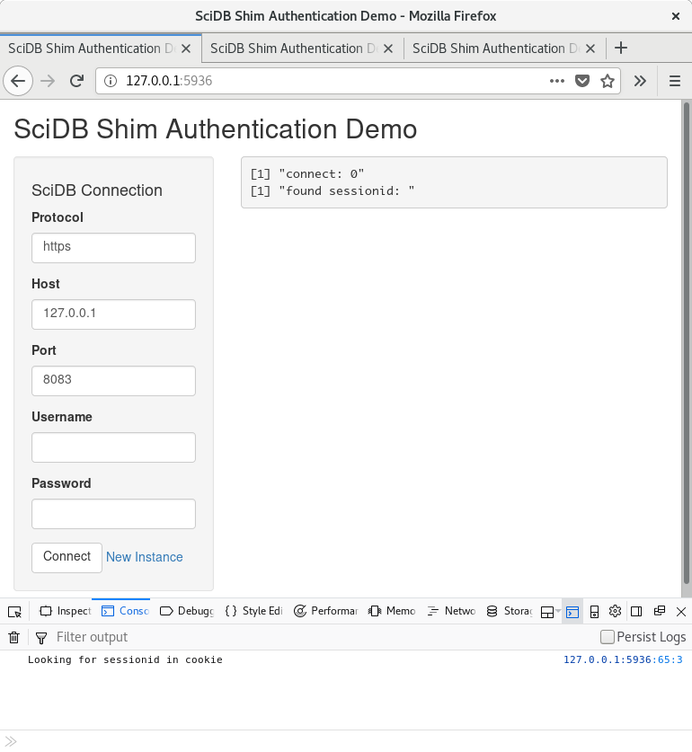
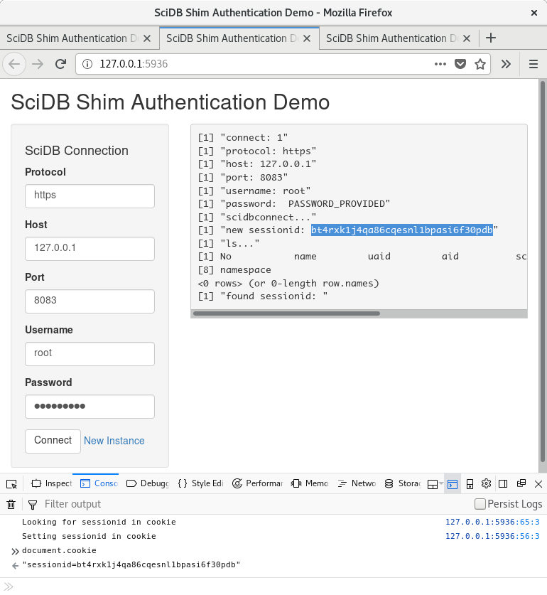
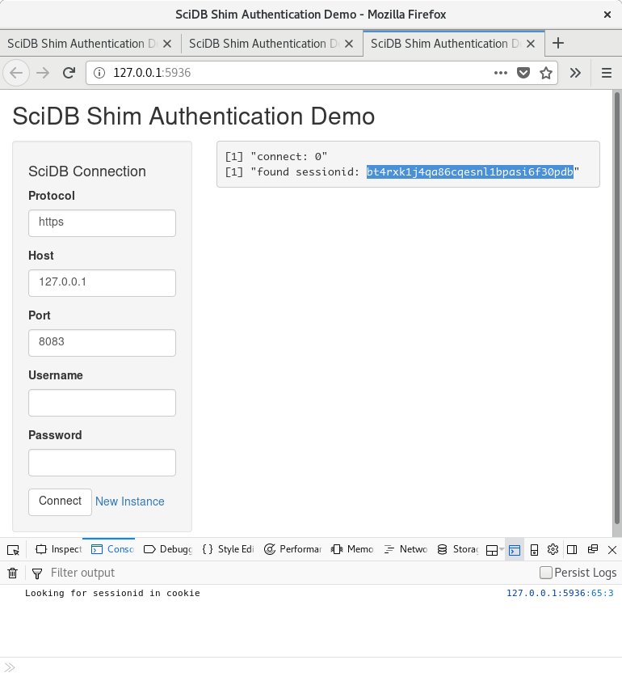

# SciDB Shim Authentication Demo

The following sections describe how the demo works and critical code
snippets at various steps are provided.

## Initial Page Load

When the demo is initially loaded in the browser the following steps
are performed:

1. Display a form for collecting SciDB connection parameters

1. JavaScript code running on the client-side checks for a `sessionid`
   key in the page cookies (discussed below). First time the page is
   loaded there are no cookies.

1. On the main page panel, `connect` represents a counter of how many
   times the *Connect* button has been clicked.



## User Clicks Connect

After the user provides the SciDB connection parameters (including
credentials) and clicks *Connect*, the following steps are preformed:

1. The server-side displays the connection parameters. Notice how
   `connect` is now set to `1`. On the server-side, a SciDB connection
   is attempted only if `connect` is greater than `0`:
   ```R
   if (input$connect > 0) {
     ...
   }
   ```

1. The server-side attempts to connect to SciDB using `scidbconnect`
   from the SciDB-R library. The `tryCatch` function is uses so that
   the demo completes successfully in case of connection error:
   ```R
   db <- tryCatch(
     scidbconnect(
       protocol = protocol,
       host = host,
       port = port,
       username = username,
       password = password
     ),
   ...
   ```

1. If the connection is successful, Shim session ID is displayed
   (`new sessionid: ...`). Moreover the `ls` function is applied over
   the connection object and the output is displayed.

1. The Shim session ID is sent to the JavaScript code running on the
   client-side using the `sendCustomMessage` function:
   ```R
   if (!is.null(db)) {
     ...
     session$sendCustomMessage("sessionid", attr(db, "connection")$session)
   }
   ```

1. When initially loaded, the JavaScript code running on client-side
   registers a function to handle messages received from the
   server-side:
   ```JavaScript
   Shiny.addCustomMessageHandler("sessionid", setSessionIDCookie);
   ```

1. When the client-side receives the message with the `sessionid` from
   the server side, the `sessionid` is added to the page cookies:
   ```JavaScript
   function setSessionIDCookie(sessionid) {
     ...
     document.cookie = "sessionid=" + sessionid;
   }
   ```

1. At this point the Shim session ID is available in the page cookies
   on the client-side.



## User Opens a New Page Instance

The user can open a new page instance in a new browser tab or window
manually (i.e., copy & paste the URL) or by clicking on *New
Instance*. When this happens, the following steps are performed:

1. The JavaScript code on the client registers a `getSessionIDCookie`
   function to be executed when the `shiny:sessioninitialized` event
   is triggered (see
   [JavaScript Events in Shiny](https://shiny.rstudio.com/articles/js-events.html)
   for details):
   ```JavaScript
   $(document).on("shiny:sessioninitialized", getSessionIDCookie);
   ```

1. The `getSessionIDCookie` function, checks the page cookies for a
   `sessionid` key and extracts its value:
   ```JavaScript
   function getSessionIDCookie() {
      ...
      sessionid = (res = new RegExp('(?:^|; )sessionid=([^;]*)').exec(
        document.cookie)) ? (res[1]) : null;
      ...
   }
   ```

1. If a `sessionid` value is present in the cookie, the value is sent
   the the server-side using an input variable with the same name:
   ```JavaScript
   if (sessionid !== null) {
     Shiny.onInputChange("sessionid", sessionid);
   }
   ```

1. On the server-side, when the `sessionid` input variable is updated,
   its value is printed out:
   ```R
   output$log <- renderPrint({
     ...
     print(paste("found sessionid:", input$sessionid))
   })
   ```

Note, that the exact same steps are executed when the page is initially
loaded, but they have no effect since the page has no cookies.


